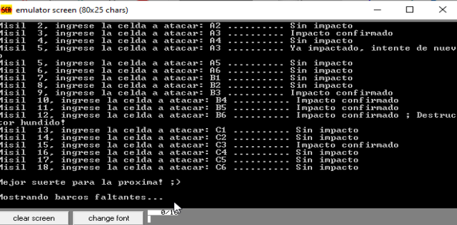

# Proyecto Batalla Naval en Assembly 8086 - Michael Estrada & Juan Plúas

---

## Descripción del Proyecto
Este proyecto consiste en desarrollar una versión para computadora del juego de mesa "Batalla Naval" utilizando el ensamblador 8086. El juego está diseñado para un solo jugador y se ejecuta en un tablero de 6x6, con una flota compuesta por un portaviones, un destructor y un submarino.

### Especificaciones Funcionales
- **Tablero**: 6x6
- **Flota**: 
  - Portaviones: 5 celdas
  - Destructor: 3 celdas
  - Submarino: 3 celdas
- **Misiles**: El jugador tiene hasta 18 misiles para hundir la flota enemiga.
- **Condiciones de Victoria**: El jugador gana si hunde toda la flota enemiga con 18 misiles o menos.
- **Finalización del Juego**: Si no se hunden todos los objetivos, se resaltan las celdas donde estaban los buques no encontrados. El jugador puede optar por jugar nuevamente o salir del programa.
- **Salida Rápida**: La combinación de teclas `CTRL+E` debe habilitarse para salir del programa en cualquier momento.

### Requisitos del Proyecto
- Utilizar el simulador emu8086.
- Validaciones adecuadas para los ingresos del usuario.
- Comentarios descriptivos en el código.

### Detalles Adicionales
- **Mapa Inicial**: Al comienzo del juego se muestra el mapa del juego pero sin mostrar los barcos.
- **Validación de Celdas Atacadas**: Durante el juego se valida si el jugador ingresó una celda que ya fue atacada previamente.
- **Resultado del Juego**: Al final se muestra si el jugador ganó o perdió, y se le pregunta si quiere empezar de nuevo con un nuevo mapa aleatorio.
## Capturas de Pantalla del Programa

### Pantalla Inicial


### Juego en Progreso


### Código Fuente en Assembly 8086
```assembly
; Proyecto Batalla Naval
; Ensamblador 8086

.model small
.stack 100h

.data
mensaje_inicio db 'BATALLA NAVAL$'
mensaje_misiles db 'Tienes 18 misiles para destruir la flota enemiga$'
mensaje_ingrese_celda db 'Ingrese la celda a atacar: $'
tablero db 'A B C D E F', 0Dh, 0Ah, '1 * * * * * *', 0Dh, 0Ah, '2 * * * * * *', 0Dh, 0Ah, '3 * * * * * *', 0Dh, 0Ah, '4 * * * * * *', 0Dh, 0Ah, '5 * * * * * *', 0Dh, 0Ah, '6 * * * * * *$', 0
misiles db 18

.code
inicio:
    mov ax, @data
    mov ds, ax
    mov es, ax

    ; Mostrar mensaje inicial
    lea dx, mensaje_inicio
    mov ah, 09h
    int 21h

    ; Mostrar mensaje de misiles
    lea dx, mensaje_misiles
    mov ah, 09h
    int 21h

    ; Mostrar tablero
    lea dx, tablero
    mov ah, 09h
    int 21h

    ; Lógica del juego
    mov cx, misiles
juego:
    ; Ingresar celda
    lea dx, mensaje_ingrese_celda
    mov ah, 09h
    int 21h
    ; Aquí se insertaría la lógica para leer la celda y procesar el ataque

    ; Decrementar misiles
    loop juego

    ; Fin del juego
    ; Mostrar mensaje de juego terminado y opción de jugar nuevamente
    ; ...
    
    ; Salida del programa
    mov ah, 4Ch
    int 21h

end inicio
```

## Referencias
- [Battleship Online](https://www.minijuegos.com/juego/battleship-online)
- Documentación y manuales de emu8086

## Instrucciones para Ejecución
1. **Compilación**: Utilice el emulador emu8086 para compilar el archivo `.ASM`.
2. **Ejecución**: Cargue y ejecute el programa en el emulador.
3. **Interacción**: Siga las instrucciones en pantalla para jugar el juego de "Batalla Naval".
